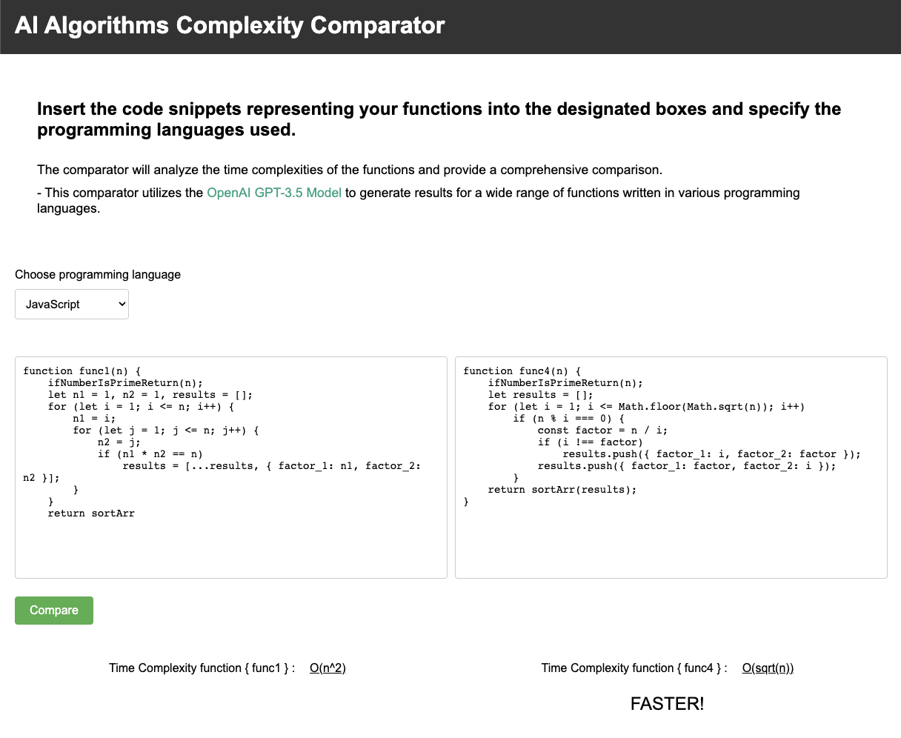

# AI Complexity-comparator

## Insert the functions into the designated boxes and OpenAI GPT-3.5 Model will analyze and output the time complexity of each function and provide a comprehensive comparison.

<br />

### Install dependencies

```
npm install
```

### Run and compile

```
npm run dev
```

<br />
<br />

-  [See site](https://complexity-comparator.web.app/)


